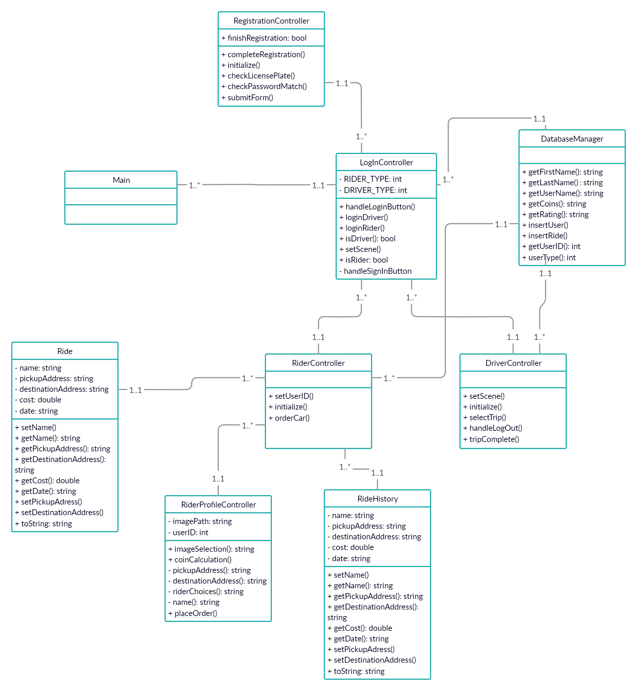

# Team 6 
Group members: Leemarie Collet, John Marx, Karan Patel, Blake Smith, and Quaide Trainter 
# Order A Car

Order A Car now has the vast majority of its functionality completed. The essentials of the program have been completed and most of the back-end logic has been written.

## Requirements

In order to run this program, an H2 database is required. Our project utilizes an [H2 Database](https://www.h2database.com/html/download.html), version 1.4.199. The jar executable must be added to the IDE's dependencies. In order for it to work on another machine, the `DB_URL` needs to be updated for the users file system. For example, when testing on our machine, one used `jdbc:h2:D:/trant/Documents/Java Practice/Order A Car2/res/userDatabase`. The `DB_URL` needs to be updated on your machine. We simply organized it into a folder "res/". H2 automatically creates the database if it does not exist.

After correctly installing the database, it is necessary to add the following to the database console: 
```
CREATE TABLE USER (
    id INT NOT NULL AUTO_INCREMENT,
    first_name VARCHAR(20),
    last_name VARCHAR(20),
    username VARCHAR(20),
    password VARCHAR(20),
    rating INT NOT NULL,
    coins FLOAT NOT NULL,
    user_type INT NOT NULL
);

CREATE TABLE RIDES (
    user_id INT NOT NULL,
    name VARCHAR(20),
    pickup_address VARCHAR(50),
    destination_address VARCHAR(50),
    cost FLOAT NOT NULL,
    date VARCHAR(20),
    completed BOOLEAN
);

```

## Video Of GUI, prototype 1
[Screen capture of our project thus far](https://www.youtube.com/watch?v=G10OfJIhees&feature=youtu.be)

## Video of GUI, prototype 2
[Recording number two!](https://www.youtube.com/watch?v=lpXW4B7Cb5Y&feature=youtu.be)

## Changes since last prototype
- RiderController added
- DriverController added
- Rider FXML updated
- Driver FXML updated
- DatabaseManager updated, cleaner code, and methods added for more complex functions
- Ride class added to handle state transfer after login
- User/Rides database tables updated to correctly capture all information
- CSS stylesheet added for backgrounds

## Features 
### Login Scene:

*	User may login in with user and password.
*	User may sign up
### Registration Scene:
*	User may create an account with user and password.
*	User may choose between rider or driver
*	If user chooses driver, they user can input car information.
### Driver Scene:
*	User can see profile and rating.
*	User may select a trip.
*	User may see available rides.
*	User may complete ride.
*	User may also see history of rides
*	User may log out.
### Rider Scene:
*	User may see profile
*	User may see current coins.
*	User may add coins.
*	User may add preferences.
*	User may add pick up address
*	User may add number of riders
*	User may schedule ride
*	User may select rated driver
*	User may select car type.
## Class Diagram

## Files
[SRS Document](SRS_Work.docx)
[Summary](summary.docx)

